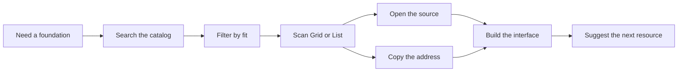

<p align="center">
  
  
  
  
</p>

<h1 align="center">Design Garage</h1>

<p align="center"><strong>A high-signal workshop for interface resources.</strong><br />Search the right foundation. Filter the noise. Ship with intent.</p>

<p align="center">
  <a href="https://components-lib-web-theta.vercel.app"><strong>Open the live garage →</strong></a>
  &nbsp;&nbsp;·&nbsp;&nbsp;
  <a href="https://github.com/sugumaran-nix/WebUI-Libraries">View source</a>
  &nbsp;&nbsp;·&nbsp;&nbsp;
  <a href="#quick-navigation">Explore the README</a>
</p>

<p align="center">
  <picture>
    <source media="(prefers-reduced-motion: reduce)" srcset="./docs/design-garage-readme-hero-static.png" />
    
  </picture>
</p>

> **Design Garage** is an independently maintained directory for interface libraries, design systems, inspiration galleries, frontend tools, and the visual resources around them.

---

## Quick navigation

| Start here | Build here | Understand here |
|---|---|---|
| [Product tour](#product-tour) | [Run locally](#run-locally) | [Design language](#design-language) |
| [Directory capabilities](#directory-capabilities) | [Deploy](#deploy) | [Project map](#project-map) |
| [Why it exists](#why-it-exists) | [Update the catalog](#update-the-catalog) | [Contributing](#contributing) |

## Product tour

Design Garage has two intentionally different surfaces. The landing page creates momentum; the directory turns that momentum into a useful search session.

| Surface | Job | Primary actions |
|---|---|---|
| [`/`](https://components-lib-web-theta.vercel.app/) | Protected marquee landing experience | Enter the directory, understand the point of view, keep the visual rhythm moving |
| [`/directory`](https://components-lib-web-theta.vercel.app/directory) | Working resource catalog | Search, filter, compare, copy, revisit, suggest, and open the original source |

### The operating loop



## Directory capabilities

The directory is organized around the actions that matter when evaluating a resource:

- **Live search** across resource names, descriptions, and technology metadata.
- **Focused filters** for category, technology, and useful ordering options.
- **Grid and List views** for visual scanning or denser evaluation.
- **Direct source links** from preview images and resource titles.
- **Copy Address** for quickly saving a resource URL without leaving the catalog.
- **Recently visited** links stored locally for fast return visits.
- **Suggest a resource** form for improving the catalog from inside the product.
- **Persistent theme preference** with deliberate light and dark color roles.
- **Shareable URL state** so filtered directory views can be revisited and shared.

<details>
<summary><strong>What can be found inside the catalog?</strong></summary>

The catalog covers React, Vue, Angular, Tailwind, shadcn, animated UI, CSS and HTML experiments, headless primitives, design tools, icons, illustrations, typography, color, mockups, templates, email references, stock assets, collections, and developer tools.

The goal is not to collect every link on the internet. The goal is to make the useful links easier to find, compare, and return to.

</details>

## Design language

Design Garage uses a **Pac-Man-inspired Neubrutalist system** instead of a generic dashboard treatment. The visual layer is loud by design; the information architecture stays quiet.

| Principle | Interface expression |
|---|---|
| **High signal** | Yellow, blue, cyan, black, and white surfaces create clear hierarchy. |
| **Tactile controls** | Ink borders, offset shadows, compact press states, and slight 8px curves. |
| **Readable contrast** | Black text on yellow states, bright text on dark surfaces, and accessible blue accents. |
| **Editorial rhythm** | Label blocks, framed previews, concise descriptions, metadata rows, and compact actions. |
| **Responsive by default** | Mobile Grid and List views are meaningfully different, with no forced desktop canvas. |
| **Quiet motion** | Desktop hover feedback is restrained; touch devices avoid hover-only movement. |
| **Protected entry** | The marquee landing composition stays stable while the directory evolves. |

### A README with motion, without the gimmicks

The hero graphic above is a lightweight repository-hosted SVG. It adds a scanline, indicator pulse, and subtle card motion when the renderer permits SVG animation, while preserving a useful static composition as the fallback. Its motion rules include a reduced-motion path, and the README itself does not depend on custom CSS or JavaScript.

## Why it exists

Useful interface resources are scattered. Awesome lists go stale, social posts disappear, and preview-only links often lose the context needed to evaluate them. Product work also needs more than a component library: it needs type, color, icons, imagery, motion, research, and production assets.

Design Garage is a single, maintained place to begin that search. It favors a short route from **need** to **source** and a clear route from **source** to **shipped work**.

## Quality bar

The interface is treated as a product rather than a static collection of cards. The release workflow checks the landing and directory routes across mobile and desktop layouts, both themes, keyboard focus states, search, filters, Grid/List controls, copy feedback, Suggest, and refresh-safe routing.

The landing marquee is a protected baseline. Directory improvements should make the catalog clearer without reshaping the landing composition or marquee behavior.

## Technology

| Layer | Choice |
|---|---|
| UI | React 18 |
| Build | Vite 5 |
| Language | JavaScript and JSX |
| Styling | Inline CSS template literal in `src/App.jsx` |
| Typography | DM Serif Display and DM Sans |
| Data | Static catalog and taxonomy in `src/data.js` |
| Deployment | Vercel-compatible SPA with `/directory` fallback |

There is no Tailwind layer and no component-library dependency in the product UI. The interface is authored from local React primitives and a shared visual vocabulary.

## Run locally

```bash
git clone https://github.com/sugumaran-nix/WebUI-Libraries.git
cd WebUI-Libraries
npm install
npm run dev
```

Open [http://localhost:5173](http://localhost:5173).

To inspect the production artifact locally:

```bash
npm run build
npm run preview
```

## Project map

```text
WebUI-Libraries/
├── docs/
│   ├── design-garage-readme-hero.gif # Animated README hero
│   └── design-garage-readme-hero-static.png # Reduced-motion fallback
├── public/
│   ├── favicon.svg
│   ├── robots.txt
│   └── sitemap.xml
├── src/
│   ├── components/
│   │   ├── DirectoryView.jsx          # Search, results, recent links, suggestion form
│   │   ├── FilterPanel.jsx             # Category, technology, order, and recent controls
│   │   ├── Icon.jsx                    # Shared inline SVG icon registry
│   │   └── ResourceCard.jsx             # Preview, metadata, copy, and source links
│   ├── App.jsx                         # Routes, themes, shared styles, landing shell
│   ├── data.js                         # Catalog data, taxonomy, and sort options
│   └── main.jsx                        # React entry point
├── index.html                          # Metadata, fonts, canonical URL, social cards
├── vercel.json                         # SPA fallback for direct `/directory` refreshes
├── package.json
└── vite.config.js
```

## Update the catalog

The catalog is intentionally simple to maintain. Add or edit resource records in `src/data.js`, keep category and technology identifiers aligned with the existing taxonomy, and run a production build before opening a pull request.

For a visual contribution, use the live **Suggest** flow first. For code, taxonomy, copy, or accessibility changes, open a focused pull request with a short explanation of the user problem being solved.

## Deploy

The project is a Vite SPA and is ready for Vercel-style deployment:

```bash
npm install
npm run build
```

The included `vercel.json` rewrites `/directory` and its nested paths to `index.html`, preventing a direct refresh from becoming a server-side 404.

## Continuous integration

Every push and pull request runs the [Design Garage CI workflow](.github/workflows/ci.yml). The pipeline installs from the lockfile, builds the production bundle, checks production dependency vulnerabilities, enforces the bundle budget, starts the production preview, exercises both routes and themes, runs browser behavior checks, and runs Axe against the mobile and desktop states.

A successful run uploads the built `dist` directory, bundle report, and accessibility report as workflow artifacts. The final deployment-readiness job verifies that the tested artifact and `/directory` SPA fallback are present. The workflow intentionally stops at a verified deployment gate; connect the repository to Vercel or add protected deployment credentials before enabling automatic production deployment.

Run the same local checks with:

```bash
npm run build
npm run ci:bundle
npm run preview -- --host 127.0.0.1 --port 4317

# In another terminal:
PREVIEW_URL=http://127.0.0.1:4317 npm run ci:browser
PREVIEW_URL=http://127.0.0.1:4317 npm run ci:a11y
```

## Contributing

Good resources, useful corrections, clearer copy, accessibility fixes, and thoughtful visual improvements are welcome. Please keep changes focused, preserve the landing marquee unless the scope explicitly changes, and verify both light and dark themes before submitting.

A strong contribution usually includes:

1. The user problem or discovery issue being addressed.
2. The smallest clear implementation that solves it.
3. The viewport and theme states checked.
4. Any relevant build or interaction verification.

## Reference points

The README’s visual and structural choices were informed by the curated [Awesome README][1], the production-oriented [Size Limit README][2], and GitHub’s official [basic writing and formatting guide][3]. The implementation uses repository-hosted media, relative links, tables, Mermaid, and a reduced-motion image fallback rather than custom README CSS or JavaScript.

[1]: https://github.com/matiassingers/awesome-readme "Curated README examples"
[2]: https://github.com/ai/size-limit "Production open-source README example"
[3]: https://docs.github.com/en/get-started/writing-on-github/getting-started-with-writing-and-formatting-on-github/basic-writing-and-formatting-syntax "GitHub formatting documentation"

## License

Released under the MIT License.

---

<p align="center"><strong>Make the next interface easier to find.</strong></p>
<p align="center"><a href="https://components-lib-web-theta.vercel.app">Enter Design Garage →</a></p>
