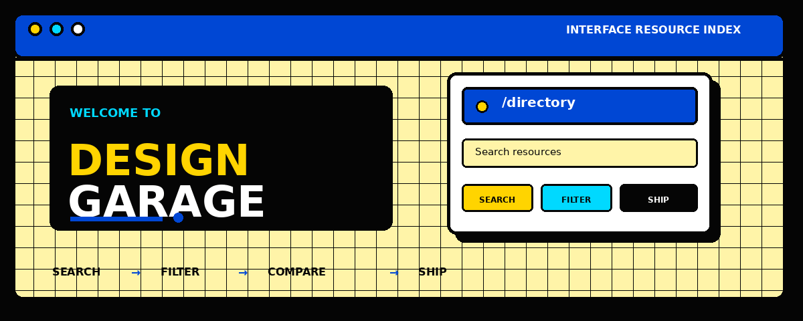

<p align="center">
  
  
  
  
</p>

<h1 align="center">Design Garage</h1>

<p align="center"><strong>A high-signal workshop for interface resources.</strong><br />Search the right foundation. Filter the noise. Ship with intent.</p>

<p align="center">
  <a href="https://components-lib-web-theta.vercel.app"><strong>Open the live garage →</strong></a>
  &nbsp;&nbsp;·&nbsp;&nbsp;
  <a href="https://github.com/sugumaran-nix/WebUI-Libraries">View source</a>
</p>

<p align="center">
  <picture>
    <source media="(prefers-reduced-motion: reduce)" srcset="./docs/design-garage-readme-hero-static.png" />
    
  </picture>
</p>

> An independently maintained directory for interface libraries, design systems, inspiration galleries, frontend tools, and the visual resources around them.

## The product

Design Garage turns a scattered resource search into one focused browsing session.

| Search | Evaluate | Return |
|---|---|---|
| Live search across names, descriptions, technologies, and resource IDs such as `resource 001`. | Filter by category, technology, order, Grid, or List. | Copy links, revisit recent resources, switch themes, and suggest the next find. |

### Two surfaces

| Route | Purpose |
|---|---|
| [`/`](https://components-lib-web-theta.vercel.app/) | Protected marquee landing experience. |
| [`/directory`](https://components-lib-web-theta.vercel.app/directory) | Searchable, filterable resource catalog. |

`Search → Filter → Scan → Open → Ship`

## Visual system

Pac-Man-inspired color, Neubrutalist edges, bold label blocks, ink borders, offset shadows, and restrained motion. The landing marquee stays protected while the directory evolves.

## Built with

React 18 · Vite 5 · JavaScript · JSX · inline CSS · DM Serif Display · DM Sans

## Run locally

```bash
git clone https://github.com/sugumaran-nix/WebUI-Libraries.git
cd WebUI-Libraries
npm install
npm run dev
```

Open [http://localhost:5173](http://localhost:5173).

Build and preview the production artifact:

```bash
npm run build
npm run preview
```

## CI/CD

Every push and pull request runs [Design Garage CI](.github/workflows/ci.yml). It builds the app, checks the production bundle budget, audits production dependencies, tests both routes and themes, runs browser behavior checks, runs Axe accessibility checks, uploads reports, and verifies the Vercel SPA fallback.

Run the same quality checks locally:

```bash
npm run build
npm run ci:bundle
npm run preview -- --host 127.0.0.1 --port 4317

# In another terminal:
PREVIEW_URL=http://127.0.0.1:4317 npm run ci:browser
PREVIEW_URL=http://127.0.0.1:4317 npm run ci:a11y
```

## Contributing

Useful resources, corrections, clearer copy, accessibility fixes, and focused visual improvements are welcome. Preserve the landing marquee, verify light and dark themes, and keep pull requests small enough to review. Read the [contribution guide](CONTRIBUTING.md) before submitting a resource, issue, or pull request.

For a quick catalog contribution, use the **Suggest** flow inside the live directory. The repository also includes structured templates for [resource suggestions](.github/ISSUE_TEMPLATE/resource-suggestion.yml) and [bug reports](.github/ISSUE_TEMPLATE/bug-report.yml).

## License

MIT

---

<p align="center"><strong>Make the next interface easier to find.</strong></p>
<p align="center"><a href="https://components-lib-web-theta.vercel.app">Enter Design Garage →</a></p>
